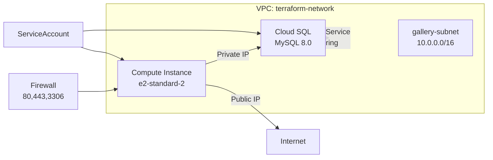

# TerraformCodebase

## Setup Instructions

1. **Clone the repository**

   ```bash
   git clone https://github.com/afeeney9/TerraformCodebase.git
   cd TerraformCodebase
   ```

2. **Configure variables**

   * Copy `terraform.tfvars.example` to `terraform.tfvars` and update values:

     ```hcl
     project = "your-gcp-project-id"
     region  = "us-central1"
     zone    = "us-central1-a"
     db_password = "your-db-password"
     ```

3. **Initialize Terraform**

   ```bash
   terraform init
   ```

4. **Review the execution plan**

   ```bash
   terraform plan
   ```

5. **Apply the configuration**

   ```bash
   terraform apply
   ```

   * Confirm with `yes` when prompted.

6. **Deploy the application**

   * The VM startup script (`cloud-init.sh`) will clone the application from Git and start the service.

7. **View Outputs**

   ```bash
   terraform output
   ```

   * `vm_public_ip`: Access the web app via this IP.
   * `vm_private_ip`: VM internal IP.
   * `cloud_sql_private_ip`: SQL instance private IP.
   * `db_connection_name`: Cloud SQL connection string.

8. **Destroy the environment**

   ```bash
   terraform destroy
   ```

## Architecture Diagram



## Notes

* Ensure your public bucket names are globally unique if adding object storage.
* For production deployments, consider using [Terraform Cloud](https://www.terraform.io/cloud) or a CI/CD pipeline.
* Secure sensitive variables using Secret Manager or environment variables.

---

For questions or contributions, please open an issue or submit a pull request.
